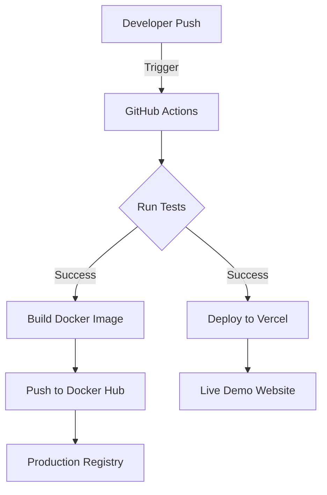

# 🌸 Iris Species Classifier: End-to-End MLOps Demo

[](https://github.com/anupamdas0515/ml-deploy-docker-cicd/actions/workflows/main.yml)
[](https://vercel.com)

A professional, production-ready demonstration of a Machine Learning model deployment. This project showcases the integration of Data Science, Backend Engineering, and DevOps practices.

---

## 🚀 Overview

This repository automates the training and deployment of a **Logistic Regression** model that classifies Iris flower species based on sepal and petal dimensions. 

### Key Features
- **Automated Training**: Python scripts to train and evaluate the model using Scikit-Learn.
- **RESTful API**: A Flask-based backend serving model inferences.
- **Modern UI**: A premium, responsive frontend with glassmorphism design.
- **Containerization**: Fully Dockerized environment for consistent deployment.
- **CI/CD Pipeline**: GitHub Actions for automated testing and Docker Hub integration.
- **Vercel Ready**: Optimized for serverless deployment on Vercel.

---

## 🏗 Architecture



---

## 🛠 Tech Stack

| Category | Technology |
| :--- | :--- |
| **Machine Learning** | Python, Scikit-Learn, NumPy |
| **Backend** | Flask |
| **Frontend** | HTML5, CSS3 (Glassmorphism), JavaScript (Vanilla) |
| **DevOps** | Docker, GitHub Actions |
| **Deployment** | Vercel, Docker Hub |

---

## 🚦 Getting Started

### Prerequisites
- Python 3.9+
- Docker (optional)

### Local Development

1. **Clone the repository:**
   ```bash
   git clone https://github.com/anupamdas0515/ml-deploy-docker-cicd.git
   cd ml-deploy-docker-cicd
   ```

2. **Install dependencies:**
   ```bash
   pip install -r requirements.txt
   ```

3. **Train the model:**
   ```bash
   python train.py
   ```

4. **Run the application:**
   ```bash
   python app.py
   ```
   Visit `http://localhost:5000` in your browser.

### Docker Usage
Build and run the container locally:
```bash
docker build -t ml-model-demo .
docker run -p 5000:5000 ml-model-demo
```

---

## 🧪 Testing

Automated tests are located in `test_app.py`. To run them:
```bash
python -m unittest test_app.py
```

---

## 📝 License

Distributed under the MIT License. See `LICENSE` for more information.

---

**Developed with ❤️ for Portfolio Showcase.**
